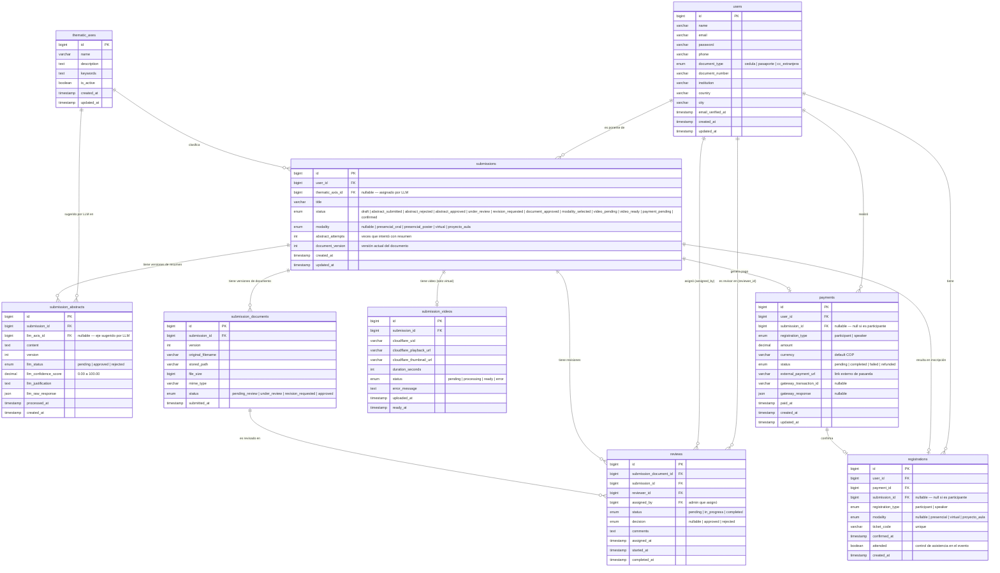
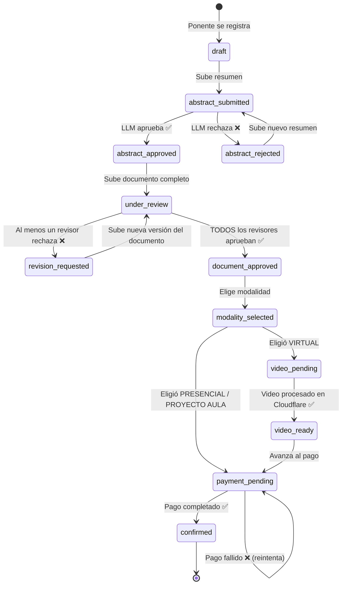

# Diagrama de Base de Datos — Congreso Ingenierías 2026

## ERD Completo



---

## Flujo de Estados de `submissions.status`



---

## Índices recomendados

```sql
-- submissions: búsquedas frecuentes por estado y por usuario
INDEX idx_submissions_status        (status)
INDEX idx_submissions_user_id       (user_id)
INDEX idx_submissions_axis_id       (thematic_axis_id)

-- reviews: buscar revisiones pendientes de un revisor
INDEX idx_reviews_reviewer_id       (reviewer_id)
INDEX idx_reviews_submission_id     (submission_id)
INDEX idx_reviews_document_id       (submission_document_id)
INDEX idx_reviews_status            (status)

-- payments: seguimiento de pagos por estado
INDEX idx_payments_user_id          (user_id)
INDEX idx_payments_status           (status)

-- registrations: ticket único
UNIQUE idx_registrations_ticket     (ticket_code)
INDEX  idx_registrations_user_id    (user_id)
```

---

## Notas de Integridad

| Regla | Descripción |
|---|---|
| `submissions.thematic_axis_id` | Nullable hasta que el LLM apruebe el resumen |
| `submissions.modality` | Nullable hasta que el ponente elija en `document_approved` |
| `reviews.decision` | Nullable mientras `status = pending` o `in_progress` |
| `payments.submission_id` | Nullable cuando `registration_type = participant` |
| `registrations.submission_id` | Nullable cuando `registration_type = participant` |
| `registrations.modality` | Nullable cuando `registration_type = participant` |
| Aprobación de documento | `status → document_approved` solo cuando **todos** los `reviews` con `submission_id = X` tienen `decision = approved` |
